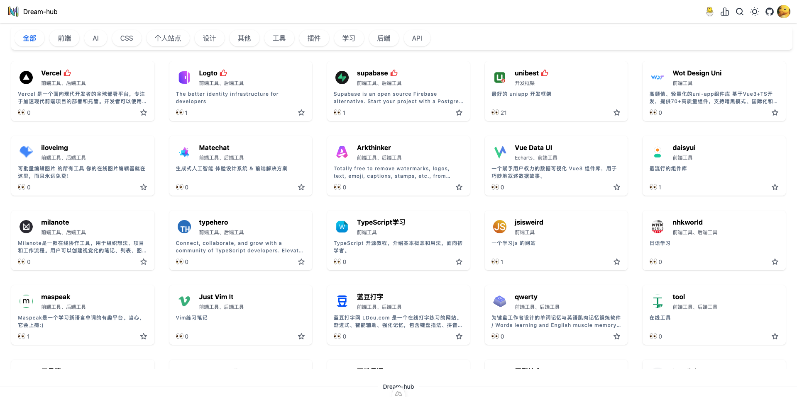
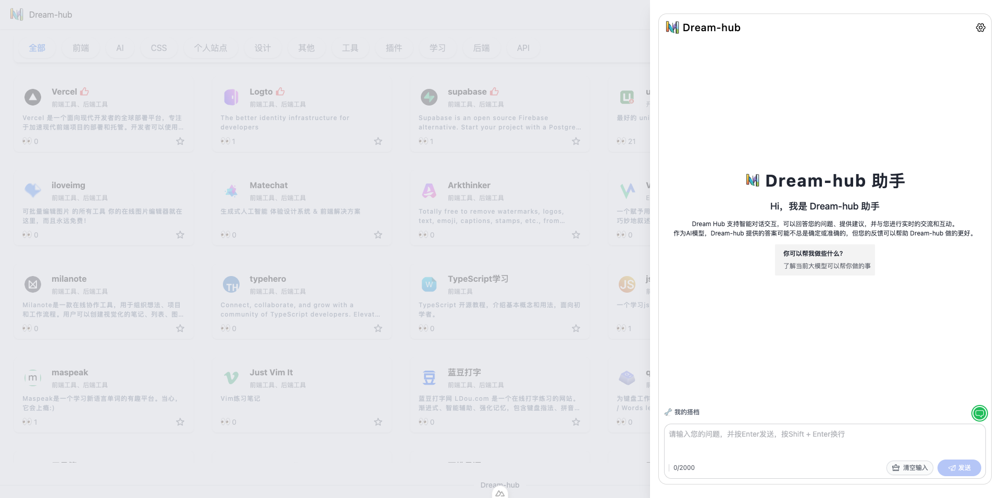

# Dream Hub 文档

欢迎来到 **Dream Hub** 文档！🚀  
[**Dream Hub**](https://dream-hub.myltx.top/) 是一个基于 **Nuxt3 + NestJS + Supabase + Logto** 的全栈项目，旨在帮助用户收集、管理、分享优质网站内容，并提供强大的 **AI 助手**，帮助你更智能地管理和推荐内容。

## 🌟 项目介绍

**Dream Hub** 让你可以轻松收藏和组织有价值的网站，并通过 **AI 分析** 提供更智能的推荐和自动分类功能。无论是日常收藏、团队协作，还是知识管理，Dream Hub 都能帮助你更高效地管理信息。

## ✨ 主要功能

- **🔖 网站收藏**：支持分类、标签管理，轻松存储你喜爱的网站。
- **📊 访问记录**：记录网站的访问情况，支持数据分析和趋势追踪。
- **📂 分类管理**：创建不同的分类，帮助你更好地整理和组织内容。
- **🔍 搜索与筛选**：支持快速搜索、标签筛选，让你高效查找信息。
- **📡 API 支持**：提供强大的 API，支持前端与后端无缝交互。
- **🔑 用户鉴权**：集成 **Logto** 进行 OAuth 认证，确保数据安全。
- **🤖 AI 智能助手**：
  - **📌 AI 聊天**：与 AI 聊天，获取个性化建议和帮助。
  <!-- - **🔍 AI 推荐**：根据你的收藏和访问记录，智能推荐类似的网站或内容。
  - **📌 自动分类**：AI 分析网站内容，自动为其匹配合适的分类和标签。
  - **📝 站点摘要**：自动生成网站的简要介绍，帮助你快速了解其内容。 -->

## 🛠️ 技术栈

Dream Hub 采用了现代 Web 技术进行开发：

- **前端**：[Nuxt 3](https://nuxt.com/) + [Vue 3](https://vuejs.org/)
- **后端**：[NestJS](https://nestjs.com/) + [Supabase](https://supabase.com/)
- **身份认证**：[Logto](https://logto.io/) 进行 OAuth 认证
- **AI 能力**：[OpenAI](https://openai.com/) / 其他 AI 模型（如 Claude、Gemini）
- **构建工具**：[pnpm](https://pnpm.io/) + [Vite](https://vitejs.dev/) + [ESLint](https://eslint.org/) + [Prettier](https://prettier.io/)

## 🚀 快速开始

如果你想在本地运行 Dream Hub，可以参考[快速开始](/guide/getting-started)指南。

## 🖼️ 预览

### 首页

### AI

---

📌 **了解更多**：

<!-- - [简介](/guide/) -->

- [快速开始](/guide/getting-started)
- [前端文档](/guide/front-end-reference)
- [后端文档](/guide/api-reference)
- [项目 GitHub 仓库](https://github.com/myltx/dream-hub)
